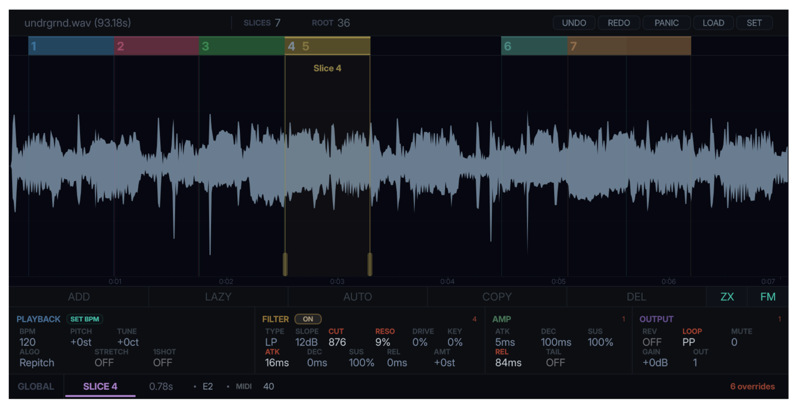

# INTERSECT

A nondestructive, time-stretching, and intersecting sample slicer plugin with independent per-slice parameter control.



## Features

- **Intersecting sample slicing** — Place slices freely on the waveform, independant of the other slices.
- **Drag-and-drop sample loading** — WAV, OGG, AIFF, FLAC, MP3
- **Slice-based playback** — create regions with start/end points, each mapped to a MIDI note
- **Parameter inheritance** — slices inherit sample-level defaults (BPM, pitch, ADSR, mute group, etc.) unless individually overridden
- **Three stretch algorithms:**
  - **Repitch** — classic sample-rate manipulation where pitch and speed are linked
  - **Stretch** — independent pitch and time control via [Signalsmith Stretch](https://github.com/Signalsmith-Audio/signalsmith-stretch), with tonality, formant shift, and formant compensation controls
  - **Bungee** — grain-based time-stretch via [Bungee](https://github.com/bungee-audio-stretch/bungee), with adjustable grain mode (Fast / Normal / Smooth)
- **Lazy chop** — play the sample continuously and place slice boundaries in real time by pressing MIDI keys
- **Auto chop** — split slices equally (2-128 divisions) or detect transients with adjustable sensitivity and live preview
- **Snap-to-zero-crossing** — click-free slice boundaries (ZX button)
- **Undo/redo** — snapshot-based undo/redo for all slice and parameter changes
- **SET BPM** — calculate BPM from a slice length and a musical time unit (4 bars down to 1/32 bar)
- **Mute groups** — voices in the same group cut each other off
- **Follow MIDI** — optionally auto-select a slice in the UI when its MIDI note is played (FM button)
- **Duplicate slice** — clone a slice with all its locked parameters
- **Hi-DPI scaling** — adjustable UI scale factor (0.5x to 3x)
- **Full state recall** — all parameters, slices, and audio data saved/restored with the DAW session
- **Custom theming** — dark, light, and custom theming

## Usage

### Getting Started

1. **Load a sample** — drag and drop an audio file onto the waveform area, or click **LOAD**
2. **Create slices** — use **ADD** to draw regions on the waveform, or **LAZY** to chop in real time
3. **Play slices** — each slice is mapped to a MIDI note starting at C2 (note 36)

### Creating Slices

- **ADD** — click the button, then click and drag on the waveform to draw a slice region
- **LAZY** — starts continuous playback; press any MIDI key to place a slice boundary at the current playhead. Click **STOP** when done. The final slice closes at the end of the sample
- **AUTO** — opens the Auto Chop bar at the bottom of the waveform:
  - **SENS** slider (0-100%) — adjusts transient detection sensitivity with live preview lines on the waveform
  - **SPLIT TRANSIENTS** — splits the selected slice at detected transient positions
  - **DIV** field — number of equal parts for time-based splitting (2-128)
  - **SPLIT EQUAL** — splits the selected slice into equal divisions
- **COPY** — duplicates the selected slice with all its parameters
- **DEL** — deletes the selected slice

### Editing Slices

- Drag the **S** handle (left edge) or **E** handle (right edge) to resize a slice
- Drag the middle of a slice to move it
- Click a slice in the waveform or slice lane to select it
- Toggle **ZX** to snap slice edges to zero-crossings (eliminates clicks)

### Keyboard / Mouse Shortcuts

- **Scroll wheel** — zoom in/out (anchored to cursor position)
- **Shift + scroll wheel** — scroll horizontally
- **Middle-click drag** — simultaneous scroll (horizontal) and zoom (vertical)

### Sample Controls (top bar)

These are the defaults inherited by all slices:

- **BPM** — sample tempo (drag vertically or double-click to type)
- **PITCH** — pitch shift in semitones (-24 to +24)
- **ALGO** — click to cycle: Repitch (speed=pitch), Stretch (independent pitch/time), or Bungee (granular)
- **ATK / DEC / SUS / REL** — ADSR amplitude envelope
- **LOOP** — loop mode: OFF, LOOP (repeat), or PP (ping-pong bounce) — click to cycle; works in all algorithm modes
- **MUTE** — mute group (voices in the same group cut each other off)
- **STRETCH** — enable time-stretching (syncs playback to DAW tempo)
- **GAIN** — master gain in dB (-100 to +24 dB)
- **TAIL** — release tail — when enabled, audio continues reading past the slice boundary during the release phase

### Slice Controls (second bar)

Per-slice overrides. Each parameter has a **override button** — click it to override the sample default for that slice.

### SET BPM

Calculates BPM from a slice's length. Select a slice, click **SET BPM**, and choose a time division (4 bars, 1 bar, 1/4 note, etc.). INTERSECT sets the BPM so that slice equals the chosen duration at your DAW's tempo.

### Follow MIDI

Click the **FM** button to toggle. When active, playing a MIDI note automatically selects that slice in the UI.

### Custom Themes

INTERSECT supports custom colour themes via `.intersectstyle` files. On first launch, the plugin creates default `dark.intersectstyle` and `light.intersectstyle` in the themes folder:

| OS | Path |
|----|------|
| Windows | `%APPDATA%\Roaming\INTERSECT\themes\` |
| macOS | `~/Library/Application Support/INTERSECT/themes/` |
| Linux | `~/.config/INTERSECT/themes/` |

To create a custom theme:

1. Copy one of the starter files from the [`themes/`](themes/) folder in this repo (or from the themes folder above) and give it a new name, e.g. `mytheme.intersectstyle`
2. Change the `name:` field to something unique — this is the name shown in the theme picker
3. Edit the 6-digit hex colour values (`RRGGBB`)
4. Place the file in the themes folder listed above
5. Restart the plugin — your theme will appear in the theme selector (right-click the header bar)

## Install

Download the latest release zip for your platform from the [Releases](https://github.com/tucktuckg00se/INTERSECT/releases) page and extract it.

Copy `INTERSECT.vst3` to your VST3 folder or run INTERSECT as a standalone app:

### Windows

```
C:\Program Files\Common Files\VST3\
```

Or run `INTERSECT.exe` as a standalone app.

### macOS

```
~/Library/Audio/Plug-Ins/VST3/
```

For AU, copy `INTERSECT.component` to:

```
~/Library/Audio/Plug-Ins/Components/
```

### Linux

```
~/.vst3/
```

After installing, rescan plugins in your DAW to pick up INTERSECT.

## Build

Requires CMake 3.22+ and a C++20 compiler.

### Windows

**Prerequisites:** [Visual Studio 2022](https://visualstudio.microsoft.com/) (Desktop development with C++ workload), [CMake 3.22+](https://cmake.org/download/)

```bash
git clone --recursive git@github.com:tucktuckg00se/INTERSECT.git
cd INTERSECT
cmake -B build
cmake --build build --config Release
```

**Output:** `build/Intersect_artefacts/Release/VST3/INTERSECT.vst3`

### macOS

**Prerequisites:** Xcode 14+ (install Command Line Tools via `xcode-select --install`), [CMake 3.22+](https://cmake.org/download/) (`brew install cmake`)

```bash
git clone --recursive git@github.com:tucktuckg00se/INTERSECT.git
cd INTERSECT
cmake -B build
cmake --build build --config Release
```

**Output:**
- VST3: `build/Intersect_artefacts/Release/VST3/INTERSECT.vst3`
- AU: `build/Intersect_artefacts/Release/AU/INTERSECT.component`

### Linux

**Prerequisites:** GCC 12+ or Clang 15+, CMake 3.22+, and JUCE system dependencies.

**Debian / Ubuntu:**

```bash
sudo apt install build-essential cmake libasound2-dev libfreetype6-dev \
  libx11-dev libxcomposite-dev libxcursor-dev libxinerama-dev \
  libxrandr-dev libxrender-dev libwebkit2gtk-4.0-dev libglu1-mesa-dev
```

**Fedora:**

```bash
sudo dnf install gcc-c++ cmake alsa-lib-devel freetype-devel \
  libX11-devel libXcomposite-devel libXcursor-devel libXinerama-devel \
  libXrandr-devel libXrender-devel webkit2gtk4.0-devel mesa-libGLU-devel
```

**Arch:**

```bash
sudo pacman -S base-devel cmake alsa-lib freetype2 \
  libx11 libxcomposite libxcursor libxinerama libxrandr libxrender \
  webkit2gtk-4.1 glu
```

Then build:

```bash
git clone --recursive git@github.com:tucktuckg00se/INTERSECT.git
cd INTERSECT
cmake -B build
cmake --build build --config Release
```

**Output:** `build/Intersect_artefacts/Release/VST3/INTERSECT.vst3`

Builds VST3, AU (macOS), and Standalone targets.

## Dependencies

- [JUCE](https://github.com/juce-framework/JUCE) (git submodule)
- [Signalsmith Stretch](https://github.com/Signalsmith-Audio/signalsmith-stretch) (git submodule, MIT license)
- [Signalsmith Linear](https://github.com/Signalsmith-Audio/linear) (git submodule, dependency of Signalsmith Stretch)
- [Bungee](https://github.com/bungee-audio-stretch/bungee) (git submodule, MPL-2.0 license)

## USE AT YOUR OWN RISK
This plugin is 100% vibe-coded

## License

This project is licensed under the [GNU General Public License v3.0](LICENSE).
