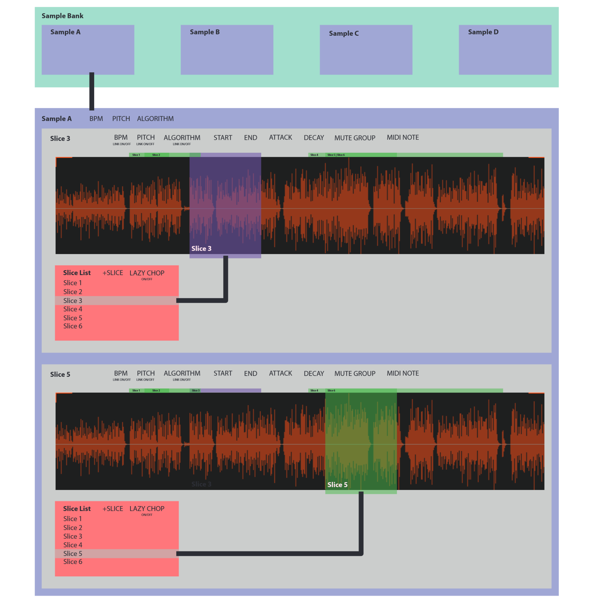

# INTERSECT

A JUCE-based audio sampler plugin that loads a single sample, slices it into regions, and triggers slices via MIDI with independent per-slice parameter control.



## Features

- **Drag-and-drop sample loading** — WAV, OGG, AIFF, FLAC
- **Slice-based playback** — create regions with start/end points, each mapped to a MIDI note
- **Parameter inheritance** — slices inherit sample-level defaults (BPM, pitch, ADSR, mute group, etc.) unless individually locked/overridden
- **Time-stretch and pitch-shift** — powered by [Signalsmith Stretch](https://github.com/Signalsmith-Audio/signalsmith-stretch) for independent pitch and time control
- **Repitch mode** — classic sample-rate manipulation for tempo changes
- **Lazy chop** — play the sample continuously and place slice boundaries in real time by pressing MIDI keys
- **SET BPM** — calculate BPM from a slice length and a musical time unit (4 bars down to 1/32 bar)
- **Mute groups** — voices in the same group cut each other off
- **Hi-DPI scaling** — adjustable UI scale factor (0.5x to 3x)
- **Full state recall** — all parameters, slices, and audio data saved/restored with the DAW session

## Build

Requires CMake 3.22+ and a C++17 compiler.

```bash
git clone --recursive git@github.com:tucktuckg00se/INTERSECT.git
cd INTERSECT
cmake -B build -S project
cmake --build build --config Release
```

Builds VST3, AU (macOS), and Standalone targets.

## Dependencies

- [JUCE](https://github.com/juce-framework/JUCE) (git submodule)
- [Signalsmith Stretch](https://github.com/Signalsmith-Audio/signalsmith-stretch) (git submodule, MIT license)

## License

All rights reserved.
