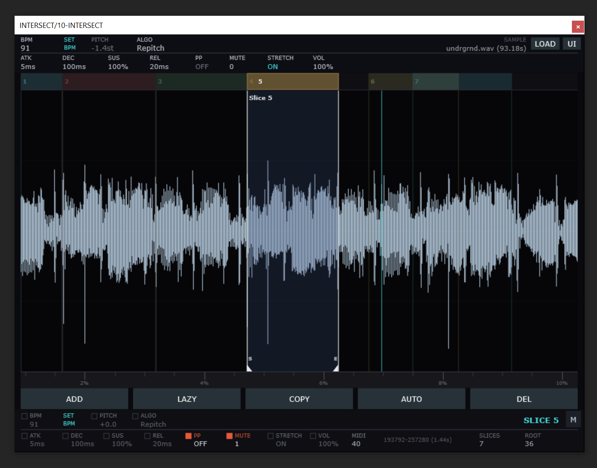

# INTERSECT

A time-stretching intersecting sample slicer plugin with independent per-slice parameter control.



## Features

- **Drag-and-drop sample loading** — WAV, OGG, AIFF, FLAC, MP3
- **Slice-based playback** — create regions with start/end points, each mapped to a MIDI note
- **Parameter inheritance** — slices inherit sample-level defaults (BPM, pitch, ADSR, mute group, etc.) unless individually overridden
- **Three stretch algorithms:**
  - **Repitch** — classic sample-rate manipulation where pitch and speed are linked
  - **Stretch** — independent pitch and time control via [Signalsmith Stretch](https://github.com/Signalsmith-Audio/signalsmith-stretch), with tonality, formant shift, and formant compensation controls
  - **Bungee** — grain-based time-stretch via [Bungee](https://github.com/bungee-audio-stretch/bungee), with adjustable grain mode (Fast / Normal / Smooth)
- **Lazy chop** — play the sample continuously and place slice boundaries in real time by pressing MIDI keys
- **SET BPM** — calculate BPM from a slice length and a musical time unit (4 bars down to 1/32 bar)
- **Mute groups** — voices in the same group cut each other off
- **MIDI-selects-slice** — optionally auto-select a slice in the UI when its MIDI note is played
- **Duplicate slice** — clone a slice with all its locked parameters
- **Hi-DPI scaling** — adjustable UI scale factor (0.5x to 3x)
- **Full state recall** — all parameters, slices, and audio data saved/restored with the DAW session
- **Dark industrial theme** — styled popup menus and controls

## Install

Download the latest release zip for your platform from the [Releases](https://github.com/tucktuckg00se/INTERSECT/releases) page and extract it.

### Windows

Copy `INTERSECT.vst3` to your VST3 folder:

```
C:\Program Files\Common Files\VST3\
```

Or run `INTERSECT.exe` as a standalone app.

### macOS

Copy `INTERSECT.vst3` to your VST3 folder:

```
~/Library/Audio/Plug-Ins/VST3/
```

For AU, copy `INTERSECT.component` to:

```
~/Library/Audio/Plug-Ins/Components/
```

Or run `INTERSECT.app` as a standalone app.

### Linux

Copy `INTERSECT.vst3` to your VST3 folder:

```
~/.vst3/
```

Or run the `INTERSECT` standalone binary directly.

After installing, rescan plugins in your DAW to pick up INTERSECT.

## Build

Requires CMake 3.22+ and a C++20 compiler.

### Windows

**Prerequisites:** [Visual Studio 2022](https://visualstudio.microsoft.com/) (Desktop development with C++ workload), [CMake 3.22+](https://cmake.org/download/)

```bash
git clone --recursive git@github.com:tucktuckg00se/INTERSECT.git
cd INTERSECT
cmake -B build -S project
cmake --build build --config Release
```

**Output:** `build/project/Intersect_artefacts/Release/VST3/INTERSECT.vst3`

### macOS

**Prerequisites:** Xcode 14+ (install Command Line Tools via `xcode-select --install`), [CMake 3.22+](https://cmake.org/download/) (`brew install cmake`)

```bash
git clone --recursive git@github.com:tucktuckg00se/INTERSECT.git
cd INTERSECT
cmake -B build -S project
cmake --build build --config Release
```

**Output:**
- VST3: `build/project/Intersect_artefacts/Release/VST3/INTERSECT.vst3`
- AU: `build/project/Intersect_artefacts/Release/AU/INTERSECT.component`

### Linux

**Prerequisites:** GCC 12+ or Clang 15+, CMake 3.22+, and JUCE system dependencies.

**Debian / Ubuntu:**

```bash
sudo apt install build-essential cmake libasound2-dev libfreetype6-dev \
  libx11-dev libxcomposite-dev libxcursor-dev libxinerama-dev \
  libxrandr-dev libxrender-dev libwebkit2gtk-4.0-dev libglu1-mesa-dev
```

**Fedora:**

```bash
sudo dnf install gcc-c++ cmake alsa-lib-devel freetype-devel \
  libX11-devel libXcomposite-devel libXcursor-devel libXinerama-devel \
  libXrandr-devel libXrender-devel webkit2gtk4.0-devel mesa-libGLU-devel
```

**Arch:**

```bash
sudo pacman -S base-devel cmake alsa-lib freetype2 \
  libx11 libxcomposite libxcursor libxinerama libxrandr libxrender \
  webkit2gtk-4.1 glu
```

Then build:

```bash
git clone --recursive git@github.com:tucktuckg00se/INTERSECT.git
cd INTERSECT
cmake -B build -S project
cmake --build build --config Release
```

**Output:** `build/project/Intersect_artefacts/Release/VST3/INTERSECT.vst3`

Builds VST3, AU (macOS), and Standalone targets.

## Dependencies

- [JUCE](https://github.com/juce-framework/JUCE) (git submodule)
- [Signalsmith Stretch](https://github.com/Signalsmith-Audio/signalsmith-stretch) (git submodule, MIT license)
- [Signalsmith Linear](https://github.com/Signalsmith-Audio/linear) (git submodule, dependency of Signalsmith Stretch)
- [Bungee](https://github.com/bungee-audio-stretch/bungee) (git submodule, MPL-2.0 license)

## USE AT YOUR OWN RISK
This plugin is 100% vibe-coded

## License

This project is licensed under the [GNU General Public License v3.0](LICENSE).
