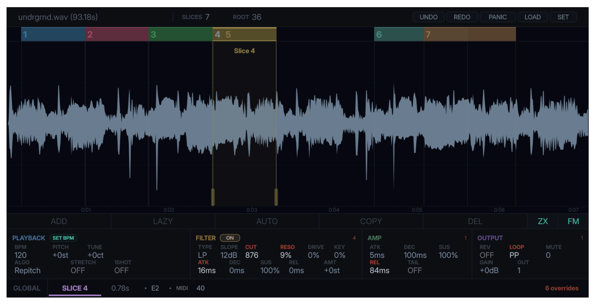

# INTERSECT

INTERSECT is a sample slicer instrument plugin (VST3/AU/Standalone) with per-slice locking, multiple time/pitch algorithms, and MIDI-triggered slice playback.



## Table of Contents

- [Quick Start](#quick-start)
- [Installation](#installation)
- [Workflow Basics](#workflow-basics)
- [Controls and Shortcuts Reference](#controls-and-shortcuts-reference)
- [MIDI Controller Routing (NRPN)](#midi-controller-routing-nrpn)
- [Theme Customization](#theme-customization)
- [Build from Source](#build-from-source)
- [Dependencies](#dependencies)
- [License](#license)
- [Support / Known Limitations](#support--known-limitations)

## Quick Start

1. Load a sample with **LOAD** or drag an audio file onto the waveform.
2. Create slices with **ADD** (draw), **LAZY** (real-time chop), or **AUTO** (transients/equal split).
3. Play slices from MIDI. New slices are mapped from root note `C2` (MIDI `36`) upward.
4. Use the second bar to lock per-slice overrides (lock icon) or inherit sample defaults.
5. Toggle **FM** if you want played MIDI notes to auto-select slices in the UI.

## Installation

Download the latest release zip from [Releases](https://github.com/tucktuckg00se/INTERSECT/releases), then place plugin files in your system plugin folders.

### Release package contents

| Platform | Included binaries |
| --- | --- |
| Windows x64 | `INTERSECT.vst3`, `INTERSECT.exe` |
| Linux x64 | `INTERSECT.vst3`, `INTERSECT` (standalone) |
| macOS arm64 | `INTERSECT.vst3`, `INTERSECT.component`, `INTERSECT.app` |
| macOS x64 | `INTERSECT.vst3`, `INTERSECT.component`, `INTERSECT.app` |

### Plugin install paths

| Format | Windows | macOS | Linux |
| --- | --- | --- | --- |
| VST3 | `C:\Program Files\Common Files\VST3\` | `~/Library/Audio/Plug-Ins/VST3/` | `~/.vst3/` |
| AU | n/a | `~/Library/Audio/Plug-Ins/Components/` | n/a |

After copying files, rescan plugins in your DAW.

### macOS unsigned build note

If macOS reports that INTERSECT is damaged or blocked, clear quarantine flags:

```bash
xattr -cr ~/Library/Audio/Plug-Ins/VST3/INTERSECT.vst3
xattr -cr ~/Library/Audio/Plug-Ins/Components/INTERSECT.component
xattr -cr /Applications/INTERSECT.app
```

## Workflow Basics

1. **One sample at a time:** INTERSECT loads one audio file per instance (`.wav`, `.ogg`, `.aiff`, `.flac`, `.mp3`).
2. **Slice creation:** Draw slices manually, chop live with **LAZY**, or split via **AUTO**.
3. **Inheritance model:** Header controls are sample defaults. Slice controls can lock overrides per field.
4. **Playback model:** MIDI triggers slices by note mapping; mute groups can choke voices in the same group.
5. **Load behavior:** File decoding/loading is asynchronous (off the audio thread).
6. **Algorithms:**
   - `Repitch`: pitch and speed are linked.
   - `Stretch`: independent time/pitch via Signalsmith Stretch (`TONAL`, `FMNT`, `FMNT C`).
   - `Bungee`: granular stretch mode with `GRAIN` choices (`Fast`, `Normal`, `Smooth`).
7. **Repitch + Stretch interaction:** when `ALGO=Repitch` and `STRETCH=ON`, `PITCH`/`TUNE` become BPM-driven read-only displays.
8. **SET BPM:** compute BPM from selected slice length (or full sample context) against a musical duration.
9. **MIDI host stop handling:** responds to `All Notes Off (CC 123)` and `All Sound Off (CC 120)`.
10. **Undo/redo:** snapshot-based history for slice and parameter edits.

## Controls and Shortcuts Reference

### Header Bar (sample defaults)

| Control | Function | Notes |
| --- | --- | --- |
| `BPM` | Sample default BPM | Drag up/down, double-click to type |
| `SET BPM` | Calculate BPM from duration menu | 16 bars to 1/16 note |
| `PITCH` | Semitone shift | `-48` to `+48` |
| `TUNE` | Fine detune | `-100` to `+100` cents |
| `ALGO` | Algorithm selector | `Repitch`, `Stretch`, `Bungee` |
| `TONAL` | Tonality limit (Stretch only) | `0` to `8000` Hz |
| `FMNT` | Formant shift (Stretch only) | `-24` to `+24` semitones |
| `FMNT C` | Formant compensation (Stretch only) | Toggle |
| `GRAIN` | Grain mode (Bungee only) | `Fast`, `Normal`, `Smooth` |
| `STRETCH` | Tempo-sync stretch toggle | Toggle |
| `1SHOT` | One-shot playback default | Plays through slice regardless of note-off |
| `ATK / DEC / SUS / REL` | ADSR defaults | Drag or type |
| `TAIL` | Release-tail toggle | Continue reading past slice edge during release |
| `REV` | Reverse playback toggle | Toggle |
| `LOOP` | Loop mode | `OFF`, `LOOP`, `PP` |
| `MUTE` | Mute group default | `0` to `32` |
| `GAIN` | Master gain | `-100` to `+24` dB |
| `VOICES` | Max playable voices | `1` to `31` |
| `LOAD` | Open file chooser | Replaces current sample |
| `PANIC` | Kill active voices immediately | Also stops lazy chop |
| `UNDO / REDO` | History navigation | Buttons in header |
| `SET` | Theme, scale, and NRPN popup | Theme chooser, `+/- 0.25` scale, and NRPN settings |
| Sample info text | Load/relink shortcut | Click sample name area to load; missing file text opens relink dialog |

### Slice Control Bar (selected slice)

| Control | Function | Notes |
| --- | --- | --- |
| Lock icon (per field) | Toggle inheritance vs override | Locked fields use per-slice value |
| `BPM`, `PITCH`, `TUNE`, `ALGO` | Per-slice core settings | Mirror sample defaults when unlocked |
| `SET BPM` | Slice BPM from duration menu | Applies to selected slice |
| `TONAL`, `FMNT`, `FMNT C` | Stretch-specific per-slice controls | Visible when `ALGO=Stretch` |
| `GRAIN` | Bungee-specific per-slice control | Visible when `ALGO=Bungee` |
| `STRETCH`, `1SHOT` | Per-slice toggles | Lockable |
| `ATK / DEC / SUS / REL` | Per-slice envelope | Lockable |
| `TAIL`, `REV`, `LOOP`, `MUTE` | Per-slice behavior controls | Lockable |
| `GAIN` | Per-slice gain override | Lockable, dB |
| `OUT` | Per-slice output bus | `1` to `16` (host bus availability applies) |
| `MIDI` | Slice MIDI note | Editable per slice |
| `ROOT` | Root note for new slices | Editable when no slices exist |

### Action Bar

| Button | Function |
| --- | --- |
| `ADD` | Toggle draw-slice mode (shows a waveform hint to drag and create a slice) |
| `LAZY` / `STOP` | Start/stop real-time lazy chopping |
| `AUTO` | Open Auto Chop panel for the selected slice (prompts you to select a slice first if none is selected) |
| `COPY` | Duplicate selected slice |
| `DEL` | Delete selected slice |
| `ZX` | Snap edits to nearest zero crossing |
| `FM` | Follow MIDI (auto-select played slice) |

### Auto Chop Panel

Requires a selected slice before opening.

| Control | Function |
| --- | --- |
| `SENS` | Transient sensitivity (`0-100%`) with live marker preview |
| `SPLIT TRANSIENTS` | Split selected slice at detected transients |
| `DIV` | Equal split count (`2-128`) |
| `SPLIT EQUAL` | Split selected slice into equal divisions |
| `CANCEL` | Close panel without applying |

### Waveform and Mouse Gestures

| Gesture | Result |
| --- | --- |
| Drag-and-drop file | Load sample |
| Click slice | Select slice |
| Drag `S` / `E` edge handles | Resize selected slice |
| Drag inside selected slice | Move slice |
| `Ctrl` + drag selected slice | Duplicate slice to new position |
| `Alt` + drag waveform | Temporary draw-slice gesture |
| Press `ADD` / `Shift + A` | Enters draw mode and shows an on-waveform hint |
| `Shift` + click waveform | Preview from clicked sample position |
| Mouse wheel | Cursor-anchored zoom |
| `Shift` + mouse wheel | Horizontal scroll |
| Middle-button drag | Combined horizontal scroll + vertical zoom |

### Keyboard Shortcuts

| Shortcut | Action |
| --- | --- |
| `Ctrl/Cmd + Z` | Undo |
| `Ctrl/Cmd + Shift + Z` | Redo |
| `Shift + A` | Toggle `ADD` mode |
| `Shift + Z` | Toggle `LAZY` / `STOP` |
| `Shift + C` | Toggle Auto Chop panel |
| `Shift + D` | Duplicate selected slice |
| `Delete` / `Backspace` | Delete selected slice |
| `Shift + X` | Toggle `ZX` |
| `Shift + F` | Toggle `FM` |
| `Right Arrow` or `Tab` | Select next slice |
| `Left Arrow` or `Shift + Tab` | Select previous slice |
| `Esc` | Close Auto Chop panel |

Single-letter action shortcuts are intentionally unbound so DAW keyboard-MIDI note entry remains available.

## MIDI Controller Routing (NRPN)

INTERSECT supports NRPN-based slice editing from a hardware or software MIDI controller. Enable it via the **SET** button in the header bar — the popup contains an NRPN section with channel and consume options.

**Controller requirements:** The controller must have **endless rotary encoders** (not fixed-range knobs) and must support NRPN mode with configurable MSB/LSB address values. Crucially, it must send **relative** data bytes — CC 96 (Data Increment) and CC 97 (Data Decrement) — one step per click. Controllers that only send absolute values (CC 6 Data Entry) will not work, nor will standard fixed-range knobs. Examples include the Akai MPD32 and MPD218. Results may vary.

Select the slice to edit by enabling **FM** (Follow MIDI) and playing its MIDI note. Then use the start/end knobs to adjust the slice boundaries. Commit happens automatically ~300ms after the knob stops moving — the same feel as releasing a parameter slider. Zoom in for finer control; each knob step moves `viewWidth / 16383` samples.

### NRPN Parameter Table

NRPN numbers use CC 99 (MSB address) / CC 98 (LSB address) to select the parameter, then CC 96 (Data Increment) or CC 97 (Data Decrement) to send a ±1 step. No absolute-value data bytes (CC 6/38) are used.

When programming a hardware controller, set the knob to **NRPN mode** with **MSB 64** and the LSB from the table below.

| NRPN | MSB | LSB | Name | Direction | Notes |
| --- | --- | --- | --- | --- | --- |
| 8193 | 64 | 1 | Zoom | CC 96 / CC 97 | Zoom in / out |
| 8194 | 64 | 2 | Slice start | CC 96 / CC 97 | Each step = viewWidth / 16383 samples |
| 8195 | 64 | 3 | Slice end | CC 96 / CC 97 | Each step = viewWidth / 16383 samples |

### SET Button — NRPN Settings

Open with the **SET** button in the header bar.

| Control | Function |
| --- | --- |
| `NRPN` | Enable/disable NRPN slice editing |
| `CONSUME CCs` | Strip NRPN edit CCs from MIDI output so they don't reach downstream instruments |
| `CH −` / `CH +` | MIDI channel filter (0 = omni) |

Settings are saved to the INTERSECT settings file alongside theme and UI scale.

### DAW-specific notes

**Ableton Live:** NRPN control does not work in Ableton Live. Ableton intercepts the CC 96/97 data-increment bytes before they reach the plugin, so the plugin only ever sees the address bytes (CC 98/99) and can never fire an event. This is an Ableton routing limitation with no known workaround on the plugin side.

**REAPER / Bitwig:** Route a MIDI track to the plugin instance as normal. No additional configuration is needed; all CC messages are forwarded to the plugin.

## Theme Customization

INTERSECT supports custom `.intersectstyle` themes. On first launch it creates default `dark.intersectstyle` and `light.intersectstyle` in the user theme directory.

| OS | Theme folder |
| --- | --- |
| Windows | `%APPDATA%\Roaming\INTERSECT\themes\` |
| macOS | `~/Library/Application Support/INTERSECT/themes/` |
| Linux | `~/.config/INTERSECT/themes/` |

Create a custom theme:

1. Copy one of the starter files from [`themes/`](themes/) and rename it, for example `mytheme.intersectstyle`.
2. Set a unique `name:` value (used in the UI theme list).
3. Edit colors as 6-digit hex `RRGGBB`.
4. Place the file in your user theme folder.
5. Restart the plugin, then use the **SET** button in the header to select the theme.

The **SET** button popup also controls interface scale (`0.5x` to `3.0x` in `0.25` steps).

## Build from Source

### Prerequisites

- CMake `3.22+`
- C++20 compiler
- Git

### Platform setup

Pick your platform below to install the required toolchain and libraries, then follow the shared **Clone and build** steps.

<details>
<summary><strong>Windows</strong></summary>

1. Install [Visual Studio 2022](https://visualstudio.microsoft.com/vs/community/) (Community edition is free).
   During installation, select the **"Desktop development with C++"** workload.
2. Install [CMake](https://cmake.org/download/) (add to PATH during install) and [Git](https://git-scm.com/download/win).

</details>

<details>
<summary><strong>macOS</strong></summary>

1. Install Xcode Command Line Tools:
   ```bash
   xcode-select --install
   ```
2. Install CMake via [Homebrew](https://brew.sh/):
   ```bash
   brew install cmake
   ```

</details>

<details>
<summary><strong>Linux — Debian / Ubuntu</strong></summary>

```bash
sudo apt update
sudo apt install -y build-essential cmake git libasound2-dev libfreetype-dev \
  libx11-dev libxrandr-dev libxcursor-dev libxinerama-dev \
  libwebkit2gtk-4.1-dev libcurl4-openssl-dev
```

</details>

<details>
<summary><strong>Linux — Fedora</strong></summary>

```bash
sudo dnf install -y gcc-c++ cmake git alsa-lib-devel freetype-devel \
  libX11-devel libXrandr-devel libXcursor-devel libXinerama-devel \
  webkit2gtk4.1-devel libcurl-devel
```

</details>

<details>
<summary><strong>Linux — Arch</strong></summary>

```bash
sudo pacman -S --needed base-devel cmake git alsa-lib freetype2 \
  libx11 libxrandr libxcursor libxinerama webkit2gtk-4.1 curl
```

</details>

### Clone and build

```bash
git clone --recursive https://github.com/tucktuckg00se/INTERSECT.git
cd INTERSECT
cmake -B build
cmake --build build --config Release
```

### Build outputs

- VST3: `build/Intersect_artefacts/Release/VST3/INTERSECT.vst3`
- Standalone:
  - Windows: `build/Intersect_artefacts/Release/Standalone/INTERSECT.exe`
  - Linux: `build/Intersect_artefacts/Release/Standalone/INTERSECT`
  - macOS: `build/Intersect_artefacts/Release/Standalone/INTERSECT.app`
- AU (macOS): `build/Intersect_artefacts/Release/AU/INTERSECT.component`

### Release workflow (repo maintainers)

Pushing a tag matching `v*` triggers the GitHub Actions release workflow, which builds and packages:

- Windows x64
- Linux x64
- macOS arm64
- macOS x64

## Dependencies

- [JUCE](https://github.com/juce-framework/JUCE) (git submodule)
- [Signalsmith Stretch](https://github.com/Signalsmith-Audio/signalsmith-stretch) (MIT)
- [Signalsmith Linear](https://github.com/Signalsmith-Audio/linear) (dependency of Signalsmith Stretch)
- [Bungee](https://github.com/bungee-audio-stretch/bungee) (MPL-2.0)

## License

INTERSECT is licensed under the [GNU General Public License v3.0](LICENSE).

## Support / Known Limitations

- INTERSECT currently works with one loaded sample per plugin instance.
- Project recall stores sample file paths; if files move, relink is required.
- Builds are unsigned; platform security prompts (especially macOS) may require manual trust/quarantine removal.
- Report bugs or request features via GitHub Issues on this repository.
