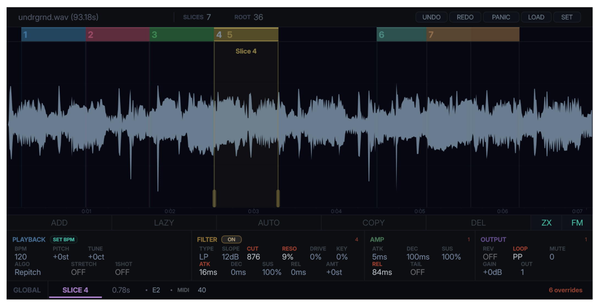

# INTERSECT

**Full documentation:** <https://tucktuckg00se.github.io/INTERSECT/>

**Support development:** [Sponsor on GitHub](https://github.com/sponsors/tucktuckg00se) · [Buy me a coffee](https://buymeacoffee.com/tucktuckgoose)

INTERSECT is a sample slicer instrument plugin (VST3/AU/Standalone) with multi-sample sessions, per-slice locking, slice note ranges, multiple time/pitch algorithms, and MIDI-triggered slice playback.


*Theme shown: Open Color (`oc.intersectstyle`)*

## Quick Start

[Watch the Quick Start Guide on YouTube](https://youtu.be/zsdtyIff2PQ)

## Install

Download the latest release zip from [Releases](https://github.com/tucktuckg00se/INTERSECT/releases) and copy the plugin files into your system plugin folder.

| Format | Windows | macOS | Linux |
| --- | --- | --- | --- |
| VST3 | `C:\Program Files\Common Files\VST3\` | `~/Library/Audio/Plug-Ins/VST3/` | `~/.vst3/` |
| AU | n/a | `~/Library/Audio/Plug-Ins/Components/` | n/a |

After copying, rescan plugins in your DAW.

**macOS first launch:** release builds are unsigned, so macOS may report INTERSECT as "damaged" on first launch. Clear quarantine flags from a Terminal:

```bash
xattr -cr ~/Library/Audio/Plug-Ins/VST3/INTERSECT.vst3
xattr -cr ~/Library/Audio/Plug-Ins/Components/INTERSECT.component
xattr -cr /Applications/INTERSECT.app
```

For per-platform release contents, ONNX Runtime bundles for stem separation, and GPU runtime requirements, see the [Installation guide](https://tucktuckg00se.github.io/INTERSECT/installation/).

## Build

```bash
git clone --recursive https://github.com/tucktuckg00se/INTERSECT.git
cd INTERSECT
cmake -B build
cmake --build build --config Release
```

Requires CMake 3.22+, a C++20 compiler, and Git. For per-OS toolchain setup, build outputs, the release workflow, and the dependency list, see [Build from source](https://tucktuckg00se.github.io/INTERSECT/building-from-source/).

## License

INTERSECT is licensed under the [GNU General Public License v3.0](LICENSE).

Automatic BPM detection uses [MiniBPM](https://github.com/breakfastquay/minibpm) © Particular Programs Ltd., distributed under the GNU General Public License v2 or later (compatible with this project's GPLv3).

## Support / Known limitations

- INTERSECT project recall stores sample file paths for every file in the session; if files move, relink is required.
- Builds are unsigned; platform security prompts (especially macOS) may require manual trust/quarantine removal.
- Report bugs or request features via [GitHub Issues](https://github.com/tucktuckg00se/INTERSECT/issues).
